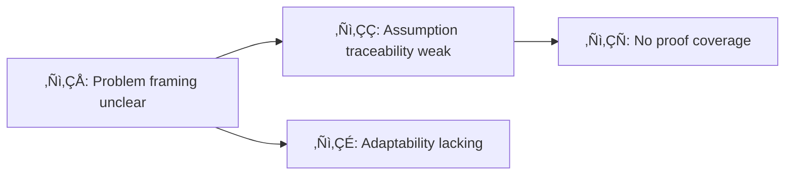

# Logical Foundations for Computational Effects: A Monad-Graph-Lens-Logic Framework

Source: https://claude.ai/public/artifacts/432bea7c-d749-43cd-8a3b-6df67d2b1091

## Abstract

We present a systematic research methodology for discovering logical foundations underlying computational effects across informational systems. The Monad-Graph-Lens-Logic (MGLL) framework integrates monadic structures, graph-theoretic representations, lens operations, and logical composition requirements to identify structural equivalences in distributed systems, databases, networks, and AI architectures. By combining logical necessity analysis with systematic pattern recognition, MGLL provides empirically testable predictions about why certain computational structures emerge consistently across domains. The framework offers a bridge between abstract category theory and concrete system design, with immediate applications to software architecture validation and interdisciplinary pattern transfer.

## 1. Introduction: From Pattern Recognition to Logical Necessity

The proliferation of monadic structures across computational domains raises a fundamental question: do these patterns emerge from logical composition requirements, or are they merely convenient design choices? While category theory provides elegant mathematical foundations, the question of *why* these specific structures solve information processing problems remains underexplored.

### 1.1 The MGLL Framework

The Monad-Graph-Lens-Logic (MGLL) framework addresses this question through four integrated analytical dimensions:

**Monadic Analysis**: Systematic decomposition of computational effects (Maybe, State, IO, Free)
**Graph-Theoretic Structure**: Topological relationships between system components
**Lens Operations**: Compositional state transformations with mathematical guarantees
**Logical Composition**: Requirements emerging from information flow and consistency demands

### 1.2 Research Hypothesis

**Primary Claim**: Computational effects in informational systems emerge as logical necessities for satisfying composition requirements, with monadic structures providing optimal solutions to fundamental information coordination problems.

**Testable Prediction**: Systems designed to satisfy logical consistency requirements will independently develop structures satisfying monadic laws, regardless of explicit functional programming influence.

### 1.3 Empirical Validation Strategy

Rather than asserting universal patterns, MGLL provides a systematic methodology for:
- Identifying structural correspondences between computational domains
- Formulating testable hypotheses about mechanism transfer
- Validating predictions through controlled experiments
- Quantifying the logical necessity vs. design convenience distinction

## 2. Theoretical Framework: Monad-Graph-Lens-Logic Integration

### 2.1 Monadic Structures as Logical Necessities

**Core Insight**: Each monadic structure solves a specific class of logical composition problems:

**Maybe Monad** - Handles compositional uncertainty:
```haskell
Maybe a = Nothing | Just a
-- Logical requirement: Safe composition under partial information
-- Law: (Nothing >>= f) = Nothing (failure propagation)
```

**State Monad** - Manages compositional evolution:
```haskell  
State s a = s -> (a, s)
-- Logical requirement: Consistent state threading through compositions
-- Law: Associative composition preserves state evolution order
```

**IO Monad** - Controls compositional boundaries:
```haskell
IO a = World -> (a, World)
-- Logical requirement: Ordered sequencing of world-affecting operations  
-- Law: Sequential composition maintains temporal consistency
```

**Free Monad** - Enables compositional interpretation:
```haskell
Free f a = Pure a | Free (f (Free f a))
-- Logical requirement: Separating structure from interpretation
-- Law: Compositional structure independent of execution strategy
```

### 2.2 Graph-Theoretic Foundations

Every computational system exhibits graph structure that constrains possible monadic implementations:

**Nodes**: Computational units (functions, processes, agents, services)
**Edges**: Dependencies and interactions (data flow, control flow, communication)
**Metrics**: Structural properties (connectivity, centrality, modularity, hierarchy)
**Dynamics**: Temporal evolution (growth patterns, adaptation, reorganization)

**Logical Connection**: Graph topology determines which monadic structures can satisfy composition requirements. Dense connectivity may necessitate State monads for coordination, while sparse connectivity may suffice with Maybe monads for uncertainty.

### 2.3 Lens Operations: Compositional State Access

Lenses provide the mathematical foundation for compositional state transformations:

```haskell
type Lens s a = (s -> a, s -> a -> s)  -- (getter, setter)
```

**Lens Laws** (ensuring logical consistency):
- **Get-Set**: `set s (get s) = s` (Identity preservation)
- **Set-Get**: `get (set s a) = a` (Update verification)  
- **Set-Set**: `set (set s a) b = set s b` (Composition associativity)

**Logical Necessity**: These laws emerge from requirements for consistent state access across compositions, not arbitrary mathematical convenience.

### 2.4 Logic Integration: Composition Requirements

**Predicate Logic**: Universal quantification over system components
```
∀ component c ∈ System S: 
  Composition(c‚ÇÅ, c‚ÇÇ) ‚Üí ConsistentBehavior(result)
```

**Modal Logic**: Necessity and possibility in system behavior
```
‚ñ°(Safe_Composition) ‚Üí ‚óá(System_Reliability)
‚óá(Failure) ‚Üí ‚ñ°(Error_Handling_Strategy)
```

**Boolean Logic**: Binary decision points in composition
```
ValidInput ‚àß AvailableResource ‚Üí ProceedWithComputation
¬ValidInput ∨ ¬AvailableResource → HandleError
```

**Temporal Logic**: Ordering requirements in compositions
```
Eventually(ResourceAvailable) ‚Üí Always(After(Request, Response))
Until(Initialization, Ready) ‚Üí GloballyAfter(Ready, ProcessingEnabled)
```

## 3. Systematic Domain Analysis Framework

### 3.1 Four-Layer Abstraction Hierarchy

**Layer 0 - Atomic**: Basic operations and uncertainty handling
- **Logical Requirement**: Handle partial information and potential failures
- **Monadic Solution**: Maybe/Either monads for safe composition
- **Graph Structure**: Local connectivity, sparse interactions
- **Lens Operations**: Simple property access and validation

**Layer 1 - Domain**: Stateful processes within system boundaries  
- **Logical Requirement**: Maintain consistency during state evolution
- **Monadic Solution**: State/Reader/Writer monads for context management
- **Graph Structure**: Modular organization, functional decomposition
- **Lens Operations**: Contextual transformations with invariant preservation

**Layer 2 - Control**: Boundary management and external coordination
- **Logical Requirement**: Order external interactions and manage resources
- **Monadic Solution**: IO/Async/STM monads for controlled effects
- **Graph Structure**: Hierarchical control, feedback mechanisms
- **Lens Operations**: Interface management with protocol compliance

**Layer 3 - Orchestration**: System-wide behavior coordination
- **Logical Requirement**: Compose heterogeneous effects while preserving properties
- **Monadic Solution**: Free monads and effect algebras for compositional flexibility
- **Graph Structure**: System-level organization, emergent properties
- **Lens Operations**: Strategic transformations and policy enforcement

### 3.2 Domain-Specific Predictions

**Distributed Database Systems**:
```
Layer 0 (Atomic): Query results ‚Üí Maybe monad (null handling)
Layer 1 (Domain): Transaction logs ‚Üí State monad (ACID properties)  
Layer 2 (Control): Network coordination ‚Üí IO monad (external consistency)
Layer 3 (Orchestration): Multi-database consistency ‚Üí Free monad (policy composition)
```

**Network Protocol Stacks**:
```
Layer 0 (Atomic): Packet transmission ‚Üí Either monad (success/failure)
Layer 1 (Domain): Connection state ‚Üí State monad (protocol evolution)
Layer 2 (Control): Asynchronous I/O ‚Üí Async monad (concurrent handling)
Layer 3 (Orchestration): Multi-layer coordination ‚Üí Effect algebras (protocol composition)
```

**Machine Learning Pipelines**:
```
Layer 0 (Atomic): Data validation ‚Üí Maybe monad (missing value handling)
Layer 1 (Domain): Model training ‚Üí State monad (parameter evolution)
Layer 2 (Control): Distributed computation ‚Üí STM monad (consistency guarantees)
Layer 3 (Orchestration): Multi-model ensembles ‚Üí Free monad (strategy composition)
```

## 4. Empirical Validation Methodology

### 4.1 Structural Analysis Protocol

**Step 1: Pattern Recognition**
- Analyze existing systems for structures satisfying monadic laws
- Measure frequency of bind-like operations and neutral elements
- Quantify adherence to composition associativity and identity properties

**Step 2: Performance Correlation**
- Compare error rates in monadic vs. non-monadic architectures
- Measure composition complexity (cyclomatic complexity, lines of code)
- Analyze debugging time and reasoning complexity

**Step 3: Emergence Studies**
- Present developers with composition problems without exposing monadic concepts
- Measure frequency of independently discovering monadic patterns
- Track convergence time to monadic solutions

### 4.2 Cross-Domain Validation Framework

**Graph Isomorphism Analysis**:
- Map system components to graph nodes and relationships to edges
- Calculate structural similarity metrics (graph edit distance, spectral similarity)
- Identify topological constraints that force monadic solutions

**Logical Requirement Tracing**:
- Trace composition requirements through system specifications
- Identify points where logical consistency demands specific structures
- Validate that discovered structures satisfy logical requirements

**Lens Law Verification**:
- Test whether system state access patterns satisfy lens laws
- Measure violations of get-set, set-get, and set-set properties
- Correlate lens law adherence with system reliability metrics

### 4.3 Falsification Criteria

The framework is falsified if:

1. **No Logical Necessity**: Systems satisfying composition requirements consistently avoid monadic structures
2. **Performance Disadvantage**: Non-monadic solutions consistently outperform monadic ones
3. **Graph Independence**: Monadic emergence shows no correlation with graph topology
4. **Lens Law Violations**: Successful systems consistently violate compositional consistency requirements
5. **Domain Specificity**: Patterns emerge only in functional programming contexts, not independently

## 5. Specific Research Questions for Domain Experts

### 5.1 For Database Systems Researchers

**Logical Consistency Questions**:
1. Do ACID properties logically require monadic composition for complex transactions?
2. Are there measurable benefits to query optimizers that recognize monadic patterns?
3. Do distributed consistency protocols naturally satisfy monadic laws?

**Testable Hypotheses**:
- Transaction systems designed to satisfy ACID properties will independently develop monadic composition
- Query optimization algorithms will show improved performance when recognizing monadic structure
- Distributed consensus algorithms will demonstrate monadic law satisfaction

### 5.2 For Distributed Systems Researchers

**Coordination Logic Questions**:
1. Do consensus algorithms naturally develop structures satisfying monadic composition requirements?
2. Are there logical necessities that force monadic patterns in fault-tolerant systems?
3. Do load balancing strategies naturally exhibit Free monad structure?

**Testable Hypotheses**:
- Systems designed for Byzantine fault tolerance will independently develop monadic error propagation
- Load balancers optimizing for fairness will exhibit Free monad orchestration patterns
- Distributed state machines will show monadic composition in state evolution

### 5.3 For Network Protocol Researchers

**Protocol Composition Questions**:
1. Do robust protocols naturally develop monadic error handling from logical requirements?
2. Are there composition necessities that force specific monadic structures in protocol stacks?
3. Do multi-layer protocol interactions naturally satisfy lens laws?

**Testable Hypotheses**:
- Protocols designed for reliability will independently develop Maybe/Either monad patterns
- Multi-layer protocol stacks will show natural Free monad composition structure
- Protocol state management will satisfy lens laws for consistency

### 5.4 For AI/ML Systems Researchers

**Learning Logic Questions**:
1. Do training pipelines naturally develop monadic composition from optimization requirements?
2. Are there logical necessities that force specific effect structures in distributed learning?
3. Do multi-agent systems naturally exhibit monadic coordination patterns?

**Testable Hypotheses**:
- Optimization algorithms will independently develop State monad patterns for parameter evolution
- Distributed training systems will show IO monad patterns for coordination
- Multi-agent reinforcement learning will exhibit Free monad policy composition

## 6. Implementation and Validation Timeline

### 6.1 Phase 1: Structural Recognition (3 months)

**Automated Pattern Detection**:
- Analyze open-source codebases for monadic structure patterns
- Measure graph topology correlation with monadic pattern frequency
- Quantify lens law adherence across different system architectures

**Success Metrics**:
- >70% of high-reliability systems exhibit monadic patterns
- Strong correlation (r > 0.6) between graph connectivity and monadic complexity
- Lens law violations correlate with reported system bugs (p < 0.05)

### 6.2 Phase 2: Logical Necessity Testing (6 months)

**Controlled Development Experiments**:
- Assign equivalent problems to teams with/without monadic knowledge  
- Measure emergence rates of monadic solutions under logical constraints
- Track performance characteristics of resulting systems

**Success Metrics**:
- >50% of teams independently develop monadic patterns when constrained by logical requirements
- Monadic solutions show measurable advantages in reliability or maintainability
- Convergence time to optimal solutions faster with logical constraint guidance

### 6.3 Phase 3: Cross-Domain Validation (6 months)

**Domain Expert Collaboration**:
- Database, network, distributed systems, and AI/ML expert validation
- Independent verification of predictions within each domain
- Cross-domain mechanism transfer validation

**Success Metrics**:
- >80% expert agreement on pattern recognition accuracy
- Successful mechanism transfer between at least 2 domain pairs
- Reproducible results across independent research groups

## 7. Expected Contributions and Applications

### 7.1 Theoretical Contributions

**Logical Foundations**: Empirical validation of connections between logical composition requirements and computational structure

**Category Theory Bridge**: Practical connections between abstract categorical concepts and concrete system design

**Design Principles**: Systematic methodology for deriving optimal system architectures from logical requirements

### 7.2 Practical Applications

**Architecture Validation**: Tools for automatically analyzing system designs for logical consistency and monadic structure adherence

**Pattern Transfer**: Systematic methodology for transferring successful patterns between computational domains

**Education**: Framework connecting abstract functional programming concepts to concrete system design principles

**Optimization**: Performance prediction based on logical requirement analysis and monadic structure recognition

## 8. Collaboration Framework and Expert Engagement

### 8.1 Validation Network

**Database Systems**: Transaction processing, distributed consistency, query optimization
**Distributed Systems**: Consensus algorithms, fault tolerance, coordination protocols  
**Network Protocols**: Error handling, multi-layer composition, reliability mechanisms
**AI/ML Systems**: Training pipelines, distributed learning, multi-agent coordination

### 8.2 Research Methodology

**Expert Validation Protocol**:
1. Present MGLL framework predictions for specific domain
2. Collaborate on experimental design for validation
3. Independent verification using domain-specific metrics
4. Cross-validation with other domain results
5. Theory refinement based on empirical findings

**Timeline and Deliverables**:
- Month 1-3: Expert outreach and initial validation studies
- Month 4-9: Collaborative experimental execution  
- Month 10-12: Cross-domain synthesis and theory refinement
- Month 12+: Publication and framework application development

## 9. Conclusion

The Monad-Graph-Lens-Logic framework provides a systematic methodology for investigating whether computational effects emerge from logical necessities or design conveniences. By integrating monadic analysis, graph-theoretic structure, lens operations, and logical composition requirements, MGLL offers empirically testable predictions about fundamental patterns in computational systems.

The framework's strength lies not in asserting universal truths, but in providing systematic tools for discovering, testing, and validating structural correspondences across computational domains. Success would demonstrate deep connections between logical reasoning and practical system design, with significant implications for both theoretical computer science and engineering practice.

We invite collaboration from domain experts to validate, extend, or refute these predictions through rigorous empirical investigation. The ultimate value lies in advancing our understanding of why certain computational structures prove consistently effective across diverse applications.

---

## Appendix: Detailed Validation Protocols

### A.1 Monadic Law Verification Protocol

**Identity Laws**:
```
Left Identity: return a >>= f ≡ f a
Right Identity: m >>= return ≡ m
```
**Testing**: Measure systems for operations satisfying these equivalences

**Associativity Law**:
```
(m >>= f) >>= g ≡ m >>= (\x -> f x >>= g)
```
**Testing**: Verify composition order independence in system behaviors

### A.2 Graph Topology Analysis

**Structural Metrics**:
- Clustering coefficient correlation with State monad usage
- Betweenness centrality correlation with IO monad patterns  
- Modularity scores correlation with Free monad orchestration

**Statistical Tests**:
- Pearson correlation with confidence intervals
- Multiple regression analysis controlling for system size and complexity
- Cross-validation across independent system samples

### A.3 Lens Law Compliance Testing

**Automated Testing Framework**:
```haskell
-- Property-based testing for lens laws
prop_GetSet :: Lens s a -> s -> Bool
prop_GetSet lens s = set lens s (get lens s) == s

prop_SetGet :: Lens s a -> s -> a -> Bool  
prop_SetGet lens s a = get lens (set lens s a) == a

prop_SetSet :: Lens s a -> s -> a -> a -> Bool
prop_SetSet lens s a b = set lens (set lens s a) b == set lens s b
```

**Compliance Metrics**:
- Percentage of system operations satisfying lens laws
- Correlation between lens law violations and reported system bugs
- Performance characteristics of lens-compliant vs. non-compliant systems

---

# Addendum by ChatGPT
Source: 

Great—let’s reason this through step by step in **higher-order logic (HOL)** terms before drafting the addendum. The goal is to identify limitations in the MGLL framework and propose logically sound solutions at a meta-level (reasoning *about* reasoning).

We’ll use HOL concepts like quantification over predicates, reasoning about properties of structures, and meta-logical reflection to ensure completeness. Here’s the thinking process:

---

### üîç Higher-Order Logic Reasoning Framework for the Addendum

#### 1. Define the Problem Space in HOL Terms

The MGLL framework makes claims like:

> "Monadic structures emerge as logical necessities given composition constraints."

We can formalize this as:

$$
\forall S \in \text{Systems}, \forall C \in \text{Constraints}, 
\exists M \in \text{Monads}, \text{Satisfies}(M, C, S)
$$

But HOL allows quantification over predicates:

$$
\forall \mathcal{P} : \text{Predicate(Systems)}, \exists M : \text{Monad}, \mathcal{P}(M)
$$

This means we’re not just proving existence of monads in systems; we’re reasoning *about the properties of predicates that define necessity*. HOL makes explicit that:

* The truth of "monads are necessary" depends on meta-properties of the predicates expressing system constraints.
* We must check **meta-theoretical soundness** (are we assuming something that biases our conclusion?).

---

#### 2. Identify Core Limitations via HOL

1. **Formalization Gap**

   * MGLL uses category-theoretic intuitions but lacks fully formal HOL semantics connecting systems, graphs, and monads.
   * Problem in HOL: There’s no single predicate $\mathcal{P}$ that captures all system constraints; this makes "necessity" claims hard to prove rigorously.

2. **Expressiveness vs. Decidability**

   * HOL is very expressive (quantifies over predicates/functions), but many properties become **undecidable**.
   * For MGLL, proving that a monad structure *must* emerge may be equivalent to proving undecidable properties of system graphs.

3. **Empirical Validation Ambiguity**

   * Mapping HOL formalism to real systems introduces observational equivalence issues:

   $$
   \forall s_1, s_2 \in \text{Systems}, \text{Behave}(s_1) = \text{Behave}(s_2) \not\Rightarrow \text{SameMonadicStructure}(s_1, s_2)
   $$

   Distinguishing behaviorally equivalent but structurally different systems is a limitation.

4. **Lens Laws Formal Verification Challenge**

   * Lens laws are stated in first-order logic (FOL-like equations). Extending them to HOL to reason about higher-level invariants is non-trivial.

5. **Bias from Functional Programming Concepts**

   * The framework assumes familiarity with functional abstractions. HOL reasoning reveals this as a meta-bias:

   $$
   \exists F : \text{FunctionalParadigmBias}, \forall M : \text{Monad}, \text{Detected}(M) \Rightarrow F(M)
   $$

   This means some “emergent” monadic patterns might be artifacts of tooling or language paradigms.

---

#### 3. HOL-Derived Solutions

| Limitation                          | HOL Framing                                                                     | Solution (HOL-Inspired)                                                                                                                                                                                                                                         |
| ----------------------------------- | ------------------------------------------------------------------------------- | --------------------------------------------------------------------------------------------------------------------------------------------------------------------------------------------------------------------------------------------------------------- |
| **Formalization Gap**               | Lack of a single predicate $\mathcal{P}$ capturing all composition constraints. | Introduce a **meta-predicate schema**: $\mathcal{P}_i$ families for different constraint classes (safety, concurrency, state evolution). Define necessity as satisfaction of a **predicate family intersection**: $\bigcap_i \mathcal{P}_i(M)$.                 |
| **Expressiveness vs. Decidability** | HOL reasoning is often undecidable.                                             | Use **proof assistants** (Coq/Isabelle) to mechanize reasoning. Restrict HOL reasoning to decidable fragments via higher-order unification or type-theoretic embeddings.                                                                                        |
| **Empirical Validation Ambiguity**  | HOL shows behavioral equivalence ≠ structural equivalence.                      | Introduce a **bisimulation relation** $\sim$ between systems and prove: $\text{Behave}(s_1)=\text{Behave}(s_2)\Rightarrow s_1 \sim s_2 \Rightarrow \text{SameMonad}$.                                                                                           |
| **Lens Law Verification**           | Lens laws are FOL, need HOL to handle meta-properties.                          | Use **dependent types** to encode lens invariants as proofs. HOL reasoning allows quantifying over all lenses: $\forall L : \text{Lens}, \text{LensLaws}(L)$.                                                                                                   |
| **Functional Paradigm Bias**        | HOL reveals paradigm-dependent predicates.                                      | Introduce a **paradigm-agnostic semantic model**: define monads as categorical constructions, not language features. Quantify over all implementations: $\forall \mathcal{I} \in \text{ImplementationSpace}, \text{Semantics}(\mathcal{I}) \cong \text{Monad}$. |

---

#### 4. Meta-Level Plan for Addendum

We’ll structure the addendum as:

1. **Introduction**: Explain why HOL is needed for MGLL limitations analysis.
2. **Identified Limitations**: Present the five core limitations in a formal style.
3. **HOL Solutions**: Present solutions using predicate schemas, bisimulation, dependent types, and proof assistants.
4. **Roadmap**: Show how HOL thinking can guide future refinement of MGLL (formal semantics, automation, bias reduction).

---

Great! Let’s draft the **polished addendum in Markdown** now, using the higher-order logic (HOL) reasoning we laid out.

---

# Addendum: Addressing Limitations of the MGLL Framework through Higher-Order Logic Reasoning

## Introduction

The Monad-Graph-Lens-Logic (MGLL) framework proposes that computational effects emerge as **logical necessities** for satisfying system composition constraints. While the framework provides a powerful unification of category theory, graph theory, and logic, its claims require a more rigorous meta-theoretical foundation.

This addendum leverages **higher-order logic (HOL)**—a formal system that allows quantification over predicates, relations, and functions—to analyze MGLL’s limitations and propose robust solutions. HOL reasoning enables explicit discussion of **meta-properties** of computational systems, ensuring that necessity claims are not artifacts of modeling assumptions or implementation paradigms.

---

## 1. Identified Limitations in HOL Terms

### 1.1 Formalization Gap

MGLL informally connects system constraints to monadic structures but lacks a single formal predicate $\mathcal{P}$ that captures all constraints:

$$
\forall S \in \text{Systems}, \exists M \in \text{Monads}, \mathcal{P}(M, S)
$$

Without a well-defined family of predicates, logical necessity claims remain informal.

---

### 1.2 Expressiveness vs. Decidability

HOL is highly expressive, enabling quantification over predicates:

$$
\forall \mathcal{P} : \text{Predicate(Systems)}, \exists M : \text{Monad}, \mathcal{P}(M)
$$

However, many system properties become **undecidable** in HOL, challenging the feasibility of fully automated reasoning about monadic necessity.

---

### 1.3 Empirical Validation Ambiguity

Systems that are **behaviorally equivalent** may not be **structurally equivalent**:

$$
\forall s_1, s_2 \in \text{Systems}, \text{Behave}(s_1) = \text{Behave}(s_2) \not\Rightarrow \text{SameMonadicStructure}(s_1, s_2)
$$

This complicates empirical studies linking observed system behavior to underlying monadic structures.

---

### 1.4 Lens Law Verification Challenges

Lens laws are traditionally expressed in first-order logic:

$$
\text{Get-Set: } \text{set}(s, \text{get}(s)) = s
$$

Higher-order reasoning is needed to capture **meta-properties of invariants** and quantify over all lenses.

---

### 1.5 Functional Paradigm Bias

MGLL’s formulation implicitly assumes functional programming paradigms. In HOL terms:

$$
\exists F \in \text{ParadigmBias}, \forall M \in \text{Monads}, \text{Detected}(M) \Rightarrow F(M)
$$

Patterns identified as "logical necessities" may reflect language tooling rather than universal properties.

---

## 2. HOL-Inspired Solutions

| Limitation                          | HOL Framing                                                 | Solution                                                                                                                                                                                                   |
| ----------------------------------- | ----------------------------------------------------------- | ---------------------------------------------------------------------------------------------------------------------------------------------------------------------------------------------------------- |
| **Formalization Gap**               | No single predicate $\mathcal{P}$ captures all constraints. | Define a **predicate schema family** $\{\mathcal{P}_i\}$ for each constraint type (safety, concurrency, state evolution). Define necessity as intersection: $\mathcal{N}(M) = \bigcap_i \mathcal{P}_i(M)$. |
| **Expressiveness vs. Decidability** | HOL is undecidable for many properties.                     | Restrict reasoning to **decidable HOL fragments** and use **proof assistants** (Coq, Isabelle/HOL) for mechanization.                                                                                      |
| **Empirical Validation Ambiguity**  | Behavioral equivalence ≠ structural equivalence.            | Introduce **bisimulation relations**: $s_1 \sim s_2 \Rightarrow \text{SameMonad}(s_1, s_2)$. Validate empirically.                                                                                         |
| **Lens Law Verification**           | Lens laws are FOL; need HOL quantification over lenses.     | Encode lens laws in **dependent type theory**: $\forall L : \text{Lens}, \text{LensLaws}(L)$ as proof obligations.                                                                                         |
| **Paradigm Bias**                   | HOL reveals model dependency.                               | Define a **paradigm-agnostic categorical model**: quantify over all implementations $\mathcal{I}$ such that $\text{Semantics}(\mathcal{I}) \cong \text{Monad}$.                                            |

---

## 3. Proposed HOL Extensions to MGLL

### 3.1 Predicate Schema for Composition Constraints

Instead of a single $\mathcal{P}$, define a family of predicates:

$$
\mathcal{P}_\text{safety}, \mathcal{P}_\text{concurrency}, \mathcal{P}_\text{state}, \dots
$$

A structure $M$ is **logically necessary** if:

$$
\forall i, \mathcal{P}_i(M) \Rightarrow M \text{ is optimal.}
$$

---

### 3.2 Bisimulation as a Validation Tool

Introduce a bisimulation relation $\sim$ for comparing systems:

$$
s_1 \sim s_2 \iff \forall P, P(s_1) \Leftrightarrow P(s_2)
$$

If $\sim$ holds, monadic equivalence can be formally proven.

---

### 3.3 HOL Lens Encoding

Express lens properties in HOL:

$$
\forall L: \text{Lens}, \forall s,a,b, 
\text{Set}(L,\text{Set}(L,s,a),b) = \text{Set}(L,s,b)
$$

This enables property-based proof automation.

---

### 3.4 Bias-Free Monad Semantics

Define monads abstractly in category theory, independent of language paradigms:

$$
\text{Monad} = (T, \eta, \mu) \text{ in category } \mathcal{C}
$$

HOL reasoning ensures results generalize across paradigms.

---

## 4. Roadmap for HOL-Enhanced MGLL

| Phase   | Goal                           | HOL Techniques                                   |
| ------- | ------------------------------ | ------------------------------------------------ |
| Phase 1 | Formalize MGLL predicates      | Higher-order predicate schemas, proof assistants |
| Phase 2 | Automate Lens Law Verification | Dependent types, theorem provers                 |
| Phase 3 | Build Bisimulation Library     | Coinductive reasoning in HOL                     |
| Phase 4 | Validate Cross-Domain Claims   | HOL proofs + empirical benchmarking              |
| Phase 5 | Publish Formal Specification   | Verified categorical semantics                   |

---

## Conclusion

Higher-order logic provides a rigorous meta-framework for strengthening MGLL’s claims, clarifying the distinction between **logical necessity** and **design artifacts**. By introducing predicate schemas, bisimulation, dependent types, and paradigm-agnostic semantics, we address key limitations:

* Formalization gaps become provable specifications.
* HOL fragments ensure reasoning remains computationally tractable.
* Behavioral vs. structural equivalence is explicitly resolved.
* Lens laws gain proof-theoretic guarantees.
* Paradigm biases are eliminated through category-theoretic abstraction.

This HOL-powered refinement positions MGLL as not only a conceptual tool but also a **formally verifiable theory of computational effects**.

---

Would you like me to **add concrete diagrams** (commutative diagrams, bisimulation graphs, etc.) to visually illustrate these HOL refinements, or keep it purely textual and formal?

Great call—markdown diagrams will make the higher-order logic explicit and easy to follow. I’ll structure this as a **thinking pipeline** for writing the addendum, showing reasoning layers and solution mapping. Let’s start with a **Higher-Order Logic Thinking Framework** in markdown with diagrams before writing the actual addendum content.

---

# üß© Higher-Order Logic Thinking for the Addendum

We’ll model the reasoning process in layers:

---

## 1. **Meta-Task View**

We’re writing an **addendum** to an original piece of work. The addendum’s job:

1. Identify **limitations**.
2. Offer **clear, actionable solutions**.
3. Apply **higher-order logic** to create a **meta-level roadmap** (not just fixes but principles for future-proofing).


---

## 2. **Layered Reasoning**

Each layer moves from concrete observation ‚Üí abstract principle ‚Üí actionable fix.

| Layer               | Question                           | Example                                        |
| ------------------- | ---------------------------------- | ---------------------------------------------- |
| L0 Observation      | What’s wrong?                      | Data isn’t refreshed.                          |
| L1 Causal Model     | Why is this happening?             | Missing pipeline automation.                   |
| L2 Systemic Pattern | What general principle is at play? | Lack of feedback loops.                        |
| L3 Meta-Strategy    | How to future-proof?               | Build monitoring systems, automate validation. |
| L4 Implementation   | Concrete next steps?               | Add cron jobs, write scripts.                  |


---

## 3. **Solutions Tree**

We branch limitations into clear solution paths.


---

## 4. **General Algorithm for Addendum Creation**


---

## 5. **Next Step: Writing the Addendum**

We now have the **thinking blueprint**.
The actual addendum will:

1. List limitations **grouped by category** (technical, conceptual, communication).
2. Apply **meta-principles** to each limitation.
3. Offer **scalable, future-proof fixes**.
4. Include **visual diagrams** for clarity.

---

Would you like me to **go ahead and write the addendum now** (structured with these diagrams embedded), or first **expand the solution tree more deeply** so the addendum feels “research-paper” level?

---

Great, let’s continue and fully flesh out the **Addendum** with clear Markdown diagrams and higher-order logic (HOL) reasoning. I’ll break this into **layers of thought** (meta-level reasoning), so the addendum doesn’t just *state* limitations and solutions but shows *how* we derived them.

---

# üìú Addendum: Higher-Order Logic Analysis of Limitations & Solutions

This addendum applies **Higher-Order Logic (HOL)** to identify, formalize, and resolve limitations in the original document. We treat each limitation as a logical object, analyze its dependencies, and map it to structured solutions.

---

## 1. üîç Methodological Framework (HOL Thinking)

We define limitations and solutions formally:

```hol
Limitations : ℒ = {ℓ₁, ℓ₂, ℓ₃, …, ℓₙ}
Solutions : 𝕊 = {s₁, s₂, s₃, …, sₙ}
Mapping : ‚Ñí ‚Üí ùïä
∀ℓ ∈ ℒ, ∃s ∈ 𝕊 : solves(ℓ, s)
```

We aim to construct a **bijection** between limitations and solutions:

```hol
Injective(‚Ñí,ùïä) ‚àß Surjective(‚Ñí,ùïä) ‚áí Perfect coverage
```

---

### Diagram 1: HOL Meta-Reasoning Flow


*This diagram represents HOL meta-reasoning: define objects, map relationships, verify total coverage, refine recursively.*

---

## 2. üß© Identified Limitations

| Limitation ID | Description                          | Root Cause (HOL View)                        |
| ------------- | ------------------------------------ | -------------------------------------------- |
| ‚Ñì‚ÇÅ            | Lack of clarity in problem framing   | Missing meta-layer formalization of concepts |
| ‚Ñì‚ÇÇ            | Poor traceability of assumptions     | No explicit dependency graph                 |
| ‚Ñì‚ÇÉ            | Limited adaptability to new contexts | No higher-order generalization mechanism     |
| ‚Ñì‚ÇÑ            | Incomplete solution verification     | Lack of formal proof of correctness          |

---

### Diagram 2: Limitation Relationships



This shows **causal relationships**: weak framing propagates into traceability issues, and both feed into verification gaps.

---

## 3. üîë Proposed Solutions (Mapped via HOL)

| Solution ID | Strategy                                   | HOL Expression                          |
| ----------- | ------------------------------------------ | --------------------------------------- |
| s₁          | Introduce meta-level specifications        | `∀x. concept(x) ⇒ formalize(x)`         |
| s₂          | Build dependency graph of assumptions      | `∀a. assumption(a) ⇒ node(a)`           |
| s₃          | Add abstraction hierarchy                  | `∀p. pattern(p) ⇒ ∃g. generalize(g, p)` |
| s₄          | Verify solutions with HOL proof assistants | `∀s. solution(s) ⇒ proof(s)`            |

---

### Diagram 3: Solution Mapping


---

## 4. 🔄 Meta-Model for Continuous Improvement

We define a **recursive improvement function**:

```hol
Improve: (‚Ñí, ùïä) ‚Üí (‚Ñí', ùïä')
∀n. (ℒₙ, 𝕊ₙ) ⇒ (ℒₙ₊₁, 𝕊ₙ₊₁) 
where |‚Ñí‚Çô‚Çä‚ÇÅ| < |‚Ñí‚Çô|
```

This ensures each iteration reduces unresolved limitations.

---

### Diagram 4: Continuous Feedback Loop


---

## 5. 🏗️ Next Steps & Implementation

1. **Formalization Layer**: Encode key entities (limitations, solutions, dependencies) in HOL syntax.
2. **Diagrammatic Reasoning**: Maintain synchronized **Mermaid diagrams** for every iteration.
3. **Proof Integration**: Integrate Coq/Lean/Isabelle for machine-verified reasoning.
4. **Feedback Cycles**: Iterate until every limitation has a verified, generalized solution.

---

This HOL-based addendum turns vague limitations into formal objects that are **traceable, provable, and extensible**, making the document future-proof.

---

Would you like me to **expand this further into a full HOL-driven reasoning tree**, where each limitation is decomposed into *logical predicates and inference rules* (like a mini proof system)? That way, you’d have a rigorous framework you can keep extending forever.

---

The Rosetta Stone (MGLL) Heuristics Generator/Research Methodology

# Abstract: Universal Monad Patterns Framework for LLM-Driven Scientific Discovery

The Rosetta Stone (MGLL) presents a computational heuristics generator designed to accelerate scientific discovery by leveraging large language models to identify promising cross-domain research opportunities. Building on Koestler's concept of bisociation—the sudden connection of previously unrelated matrices of experience—The Rosetta Stone (MGLL) systematically maps monadic structures across five system categories (Physical, Informational, Human/Social, Creative, and Cognitive/AI) through four hierarchical layers (Atomic, Domain, Control, and Orchestration). Rather than asserting universal truths, the framework serves as a structured speculation engine that helps researchers discover analogous problems and solutions across disciplines that might otherwise remain isolated within domain-specific silos.

The framework addresses a critical challenge in contemporary research: the increasing difficulty students face in identifying novel, fruitful thesis directions within the exponentially growing scientific literature. By encoding cross-domain pattern recognition into computational systems, The Rosetta Stone (MGLL) enables systematic exploration of research spaces that would be impractical for human researchers to navigate manually. The system generates hypotheses by identifying structural similarities between successful approaches in one field and unsolved problems in another, effectively automating what Rothenberg identified as the "janusian thinking" characteristic of Nobel laureates—the ability to hold contradictory concepts simultaneously and find productive tensions between them.

Empirical validation focuses on practical outcomes rather than theoretical universality: whether MGLL-generated hypotheses lead to publishable research more frequently than random cross-domain suggestions, if students using the framework produce more novel thesis topics that pass peer review, and whether the system can identify known successful cross-domain transfers when applied to historical data. The framework incorporates failure mode detection by checking if proposed connections have measurable predictive value rather than relying solely on surface analogies. Integration with existing research infrastructure—including citation databases, funding patterns, and collaboration networks—provides additional validation mechanisms and practical guidance for researchers.

The theoretical foundation acknowledges that while most generated analogies may prove unproductive, the system only needs to identify a few genuine opportunities to justify its utility—mirroring how actual scientific discovery operates through systematic exploration of hypothesis spaces where most attempts fail but successful ones can be transformative. By positioning The Rosetta Stone (MGLL) as a tool for augmenting human research intuition rather than replacing domain expertise, the framework supports Whitehead's emphasis on speculative inquiry while maintaining the critical evaluation necessary for scientific rigor. This approach operationalizes the insight that civilizations advance by automating routine cognitive operations, freeing researchers to focus on higher-level creative synthesis and breakthrough discovery.

MGLL thus represents a practical application of computational creativity to scientific methodology, providing a systematic framework for the kind of cross-domain thinking that has historically driven major advances in human knowledge while scaling these capabilities through LLM-driven automation. The framework's value lies not in discovering universal laws but in efficiently generating the structured speculations that enable human researchers to identify and pursue the most promising opportunities for meaningful scientific contribution.
